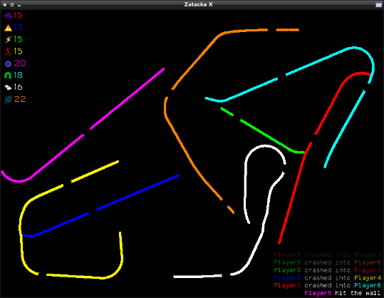

# Zatacka X
Zatacka X is a modern, free remake of the classic Achtung, die Kurve!. In
addition to all the features from the original game, Zatacka X includes
special weapons, updated graphics, sound effects and AI controlled
opponents.

## Installation
### From a repository
* AROS: [The AROS Archives](http://archives.aros-exec.org/?function=showfile&file=game/misc/zatackax.i386-aros.zip)
* Arch Linux: [Arch User Repository (AUR)](https://aur.archlinux.org/packages/zatackax-git)
* KISS: [KISS GAMES](https://github.com/sdsddsd1/kiss-games)
* MorphOS: [MorphOS Storage](https://www.morphos-storage.net/?id=1612660)
* Nintendo Switch: [lizardman0/zatackax](https://github.com/lizardman0/zatackax/releases)
* Open Pandora: [repo.openpandora.org](https://repo.openpandora.org/?page=detail&app=zatackax_ptitseb)
* OpenDingux: [OpenDingux Software list](https://github.com/retrogamehandheld/OpenDingux/#games--ports)
* openSUSE: [openSUSE Software](https://software.opensuse.org/package/zatackax)

### From source
To install Zatacka X from source, run:

    $ ./configure
    $ make
    $ sudo make install

If you want to run Zatacka X directly from the source directory
instead of installing it, run `make devel` instead of `make` in the
second step:

    $ ./configure
    $ make devel
    $ ./zatackax

Compilation depends on the following libraries:

* SDL 1.2
* SDL_image 1.2
* SDL_ttf 2.0
* SDL_mixer 1.2

These are often provided by GNU/Linux distributions. Under Debian, for
instance, the following command installs the required libraries:

    $ sudo apt install libsdl1.2-dev libsdl-image1.2-dev libsdl-ttf2.0-dev libsdl-mixer1.2-dev

## License
The Zatacka X code is free software, licensed under the GNU General
Public License version 3, or (at your option) any later version. See
[COPYING](COPYING) for details.

All other content (graphics, audio) are licensed under Creative
Commons Attribution-ShareAlike (CC BY-SA), unless otherwise noted in
the [AUTHORS](AUTHORS.md) file.

## Contact
Questions, suggestions, contributions or other inquiries? Please
contact simenheg@runbox.com.
